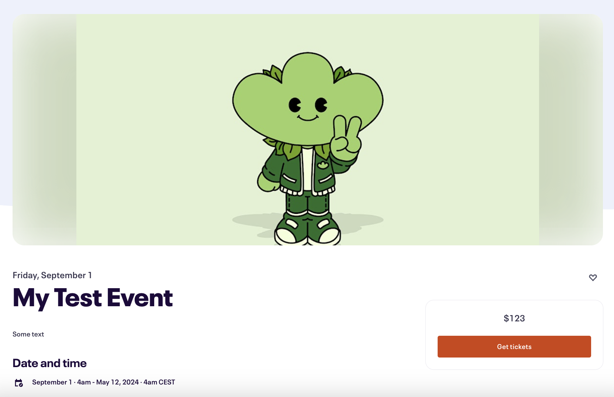
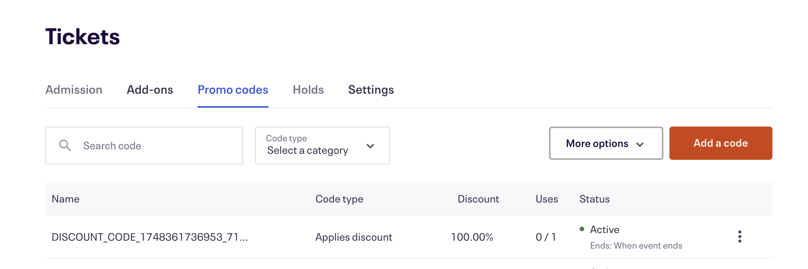
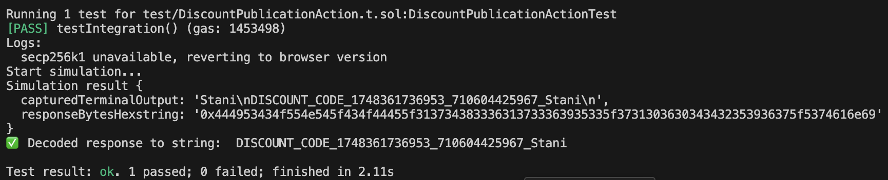
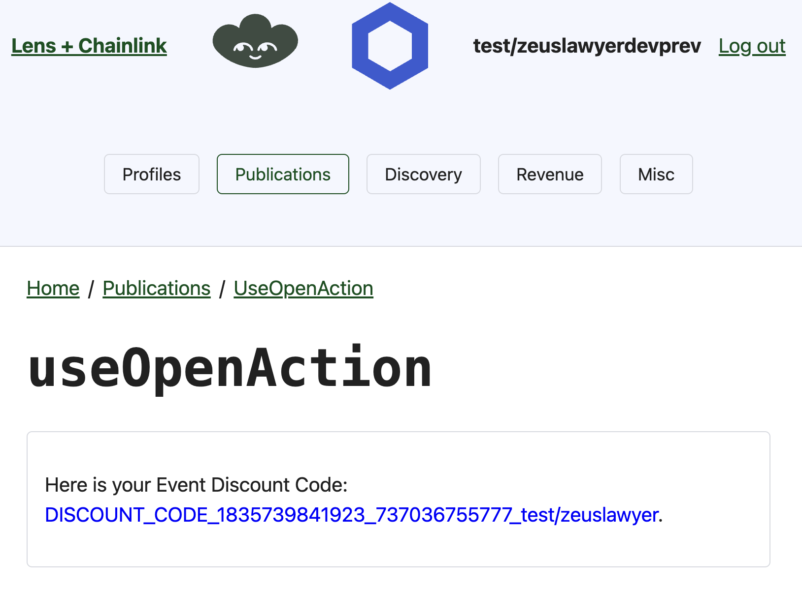

# Functions Lens Eventbrite

This project combines [Chainlink Functions](https://docs.chain.link/chainlink-functions) with [Lens Publication Actions](https://docs.lens.xyz/v2/docs/publication-actions-aka-open-actions) to demonstrate how one can generate discount codes for events on Eventbrite using Collect module.

## Prerequisites

- [Git](https://git-scm.com/book/en/v2/Getting-Started-Installing-Git)
- [Current LTS Node.js version](https://nodejs.org/en/about/releases/)
- [Foundry](https://book.getfoundry.sh/getting-started/installation)
- Connect your wallet and get a Lens profile from [this URL](https://testnet.hey.xyz/). Make sure your wallet is connected to Polygon Mumbai and that you have[ Matic in your wallet](https://faucet.polygon.technology/).
- Fund your wallet with some [LINK](faucets.chain.link)

## Getting Started

1. Install smart contract packages

```
cd contracts && npm install
```

2. Compile contracts

```
forge build
```

3. Install UI packages

```
cd ../app && npm install
```

If dependency clashes arise please run `npm install --force`

4. Start the server

```
npm run dev
```

## What are we building?

Using Chainlink Functions and Lens Publication Actions, we are going to develop a system for generating discount codes for events (like Smartcon or Raave for example) hosted on Eventbrite.

The event organizer will need to create a new event on Eventbrite, following [these instructions](https://www.eventbrite.com/help/en-us/articles/551351/how-to-create-an-event).



To develop and use this project, you will need to obtain a [free Eventbrite OAUTH token](https://www.eventbrite.com/help/en-us/articles/849962/generate-an-api-key/).

Once you generate an Eventbrite OAUTH token, you can visit the following web page to validate it works as expected `https://www.eventbriteapi.com/v3/users/me/?token=<YOUR_OAUTH_TOKEN_GOES_HERE>`

Next, you will need to get your

- **Organization ID**, by visiting `https://www.eventbriteapi.com/v3/users/me/organizations/?token=<YOUR_OAUTH_TOKEN_GOES_HERE>`
- **Event ID**, by visiting `https://www.eventbriteapi.com/v3/organizations/<ORGANIZATION_ID_GOES_HERE>/events/?token=<YOUR_OAUTH_TOKEN_GOES_HERE>`

The core logic is stored in the [`DiscountPublicationAction.sol`](./src/DiscountPublicationAction.sol) smart contract which implements `IPublicationActionModule` and `FunctionsClient` interfaces. On Lens collect, it will make a Chainlink Functions request to execute the JavaScript code from the [`source.js`](./source.js) file, which will resolve User's address to a Lens handle and generate the Eventbrite discount code for the provided event. The [`DiscountPublicationAction.sol`](./src/DiscountPublicationAction.sol) smart contract will then store the returned discount code.



## Usage

For setting up environment variables we are going to use the [`@chainlink/env-enc`](https://www.npmjs.com/package/@chainlink/env-enc) package for extra security. It encrypts sensitive data instead of storing them as plain text in the `.env` file, by creating a new, `.env.enc` file. Although it's not recommended to push this file online, if that accidentally happens your secrets will still be encrypted.

1. Change into the `./contracts` directory to set up its dependencies. Make sure commands in [this USAGE SECTION](#usage) are run from inside this directory. Start with `npm install` if you've not done that yet.

```shell
cd contracts
```

2. Set a password for encrypting and decrypting the environment variable file. You can change it later by typing the same command.

```shell
npx env-enc set-pw
```

2. Now set the `OAUTH_KEY`, `PRIVATE_KEY` and `POLYGON_MUMBAI_RPC_URL` environment variables by typing:

```shell
npx env-enc set
```

After you are done, the `.env.enc` file will be automatically generated.

If you want to validate your inputs you can always run the following command:

```shell
npx env-enc view
```

3. Run local simulation

```
forge test -vvv --ffi
```



## Deployment

To deploy [`DiscountPublicationAction.sol`](./src/DiscountPublicationAction.sol) smart contract, prepare the following constructor arguments:

- `hub` - The address of a Lens' [LensHub](https://docs.lens.xyz/v2/docs/deployed-contract-addresses#mumbai-developer-preview) smart contract
- `moduleGlobals` - The address of a Lens' [ModuleGlobals](https://docs.lens.xyz/v2/docs/deployed-contract-addresses#mumbai-developer-preview) smart contract
- `router` - The address of a Chainlink [Functions Router](https://docs.chain.link/chainlink-functions/supported-networks) smart contract
- `subscriptionId` - The ID of your Chainlink Functions subscription which you can create at [Functions Subscription Manager](https://functions.chain.link/) following steps from the [Official Documentation](https://docs.chain.link/chainlink-functions/resources/subscriptions)
- `callbackGasLimit` - The [maximum gas](https://docs.chain.link/chainlink-functions/api-reference/functions-client) that Chainlink Functions can use when transmitting the response to your contract
- `donIdBytes32` - The ID of a Chainlink Functions [DON to be invoked](https://docs.chain.link/chainlink-functions/supported-networks). This needs to be converted to `bytes32` with `cast --format-bytes32-string "fun-polygon-mumbai-1"` or via etherjs with `node getDonIdBytes.js fun-polygon-mumbai-1`.

Then run the `forge create` command:

```
forge create --rpc-url <your_rpc_url> \
    --private-key <your_private_key> \
    --constructor-args <hub> <moduleGlobals> <router> <subscriptionId> <callbackGasLimit> <donIdBytes32> \
    --etherscan-api-key <your_etherscan_api_key> \
    --verify \
    --legacy \
    src/DiscountPublicationAction.sol:DiscountPublicationAction
```

Make a note of your deployed contract.

Navigate to your Chainlink Functions subscription at [Functions Subscription Manager](https://functions.chain.link/) and add this newly deployed smart contract as your subscription's consumer by clicking the `Add Consumer` button and providing the address of a smart contract.

Then Head to the [Lens V2 ModuleGlobals Contract on Mumbai](https://mumbai.polygonscan.com/address/0x8834aE494ADD3C56d274Fe88243526DBAB15dEF8) and from the `Contracts` tab, click on `Write as Proxy`. Connect your wallet to the page, and then call `registerModule` with the following arguments:

- `moduleAddress` : the Open Action with Functions contract you just deployed
- `moduleType`: 1 (Enum for Open Action) ([ref](https://docs.lens.xyz/v2/docs/publishing-a-module))

Finally, we want to encrypt the secrets that will be injected by the Chainlink DON into the `./contracts/source.js` script.

Make sure you're in the `./contracts` director and run `node generateSecrets.js`. This will take the secrets that you've set in the `.env.enc` file, and encrypt them with the DON public key so that it can only be Decrypted by Chainlink DON Nodes. These decrypted secrets get uploaded and stored in the DON and then injected at run time into the script in `./contracts/source.js`. Please inspect `./contracts/generateSecrets.js` to understand more.

When the secrets have been successfully uploaded your console print info that looks like the following:

```
❯ node generateSecrets.js
secp256k1 unavailable, reverting to browser version
Version: 1699842119
Slot ID: 0
```

Make a note of the Version and Slot ID. You will need to update the webapp code with this.

## Web App and its Environment Variables

Navigate to the `app` folder and create a `.env` file there and double check it is `gitignored`.

Then add the following values to your `.env`:

```
VITE_ORG_ID
VITE_EVENT_ID
```

You would have obtained these secrets when running the setup steps for your Open Actions With Functions Smart Contract.

Run `npm install` from inside your project root. If dependency clashes arise please run `npm install --force``

Then run `npm dev`` to start the server.

## Front end interaction steps

1. For all these steps, please note the `TODO @dev` instructions in the file.

2. Once your profile is created go to `useProfile.tsx` in `./src/profiles`. Update the `TODO @dev` comment there with your profile handle and that should trigger the web app to render your profile if you navigate to `localhost/profiles/useProfile`.

3. Then open the `./app/src/publications/UseOpenAction.tsx` file. Update the `TODO @dev` comments. You'll need the values from when you uploaded your app secrets to the DON. Once you've saved the file with your updates, navigate to `http://localhost:PORT/publications/useOpenAction` and enter the Open Action With Functions Smart Contract contract address that you had deployed. Create your publication by clicking the CREATE SAMPLE POST button. Note you will have to sign 2 transactions - one to upload your post to Arweave and the other to initialize your Open Actions with Functions smart contract.

If you open your browser dev tools, you can see the logs that contain info about the post upload to arweave and other inputs that will be sent to the blockchain in subsequent steps.

4. When your Open Action published is posted and finalized on the blockchain, you will see a button to interact with the Open Action that is mounted to your publication. To check your publication on the Hey app you can navigate to `https://testnet.hey.xyz//u/<<YOUR_LENS_V2_PROFILE_ID>>` in a new tab to see your posts.

5. Click on the GET DISCOUNT CODE button and sign the transactions. If you look at your chrome dev tools you will see the giant bytecode that contains the data that is submitted to `processPublicationAction` in your Functions-enabled publication contract.

6. You can wait about 30 seconds or so for the UI to update with the event URL and the discount code applied. Alternatively got to the Mumbai blockexplorer at `https://mumbai.polygonscan.com/address/YOUR_CONTRACT_ADDRESS`, click on "READ" and take a look at the requestID and then the `s_lastResponse` field. If that is `0x` then there has been an error (and no discount URL will show up on the front end). You can check the error on the block explorer by clicking on `s_lastError`. The bytes hex shown there can be decoded into its string using [this converter tool](https://codebeautify.org/hex-string-converter).

If successful the UI will look like this:


## Disclaimer

This tutorial offers educational examples of how to use a Chainlink system, product, or service and is provided to demonstrate how to interact with Chainlink’s systems, products, and services to integrate them into your own. This template is provided “AS IS” and “AS AVAILABLE” without warranties of any kind, it has not been audited, and it may be missing key checks or error handling to make the usage of the system, product, or service more clear. Do not use the code in this example in a production environment without completing your own audits and application of best practices. Neither Chainlink Labs, the Chainlink Foundation, nor Chainlink node operators are responsible for unintended outputs that are generated due to errors in code.
